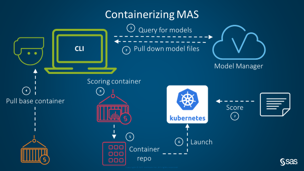
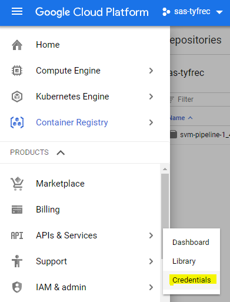
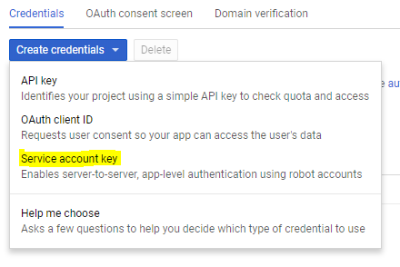
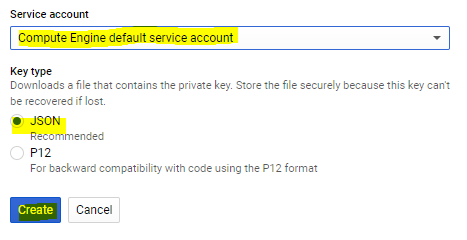

# Productionizing Models

This project contains a prototype of a process for productionizing models in containers. In general, here is how the process works:

* A CLI is provided that automates a lot of this process. It:
    * Queries SAS Model Manager for available models
    * Pulls down model files and base container templates to build a purpose-built container for scoring that particular model
    * Pushes the container to a repo and launches the container on a Kubernetes cluster
    * Executes scoring of a file against that container

See Setup.txt for general setup instructions. This README describes how to set up the environment to run in the images we've configured for the EYAP bootcamp. Please contact [Tyler Freckmann](mailto:tyler.freckmann@sas.com) if you have questions about this.



## About the project

The jupyter notebook files (.ipynb) contain examples of how to run the CLI. This prototype has been tested and works on 3 environments: Dev, AWS, and GCP. The configuration for these different environments can be found in `cli.properties`. 

## Set Up (on EYAP bootcamp servers)

Make sure you are on the environment you've configured for the EYAP bootcamp. The exercises will use GCP, so we will be verifying and configuring for that environment, but if you'd like to run in Dev or AWS mode, make sure you've configured those environments appropriately according to Setup.txt

### 0.0 Verify User

**WE WILL BE LOGGING IN AS CLOUD-USER AND REMAIN AS CLOUD-USER FOR THE DURATION OF THE EXERCISES. MAKE SURE YOU ARE CLOUD-USER.**

```sh
$ whomai
cloud-user
```

### 0.1 Clone (and fork if you desire) this repo into your home directory

```sh
cd ~
git clone https://gitlab.sas.com/eyapbootcamp/thursday.git
cd thursday
```

### 0.2 Verify Docker, Kubernetes, and GCP configuration

Verify Docker is installed:

```sh
docker --version
```

Verify Kubernetes kubectl is installed (Don't worry if you get a connection error. Just make sure the command is recognized.)

```sh
kubectl version
```

Make sure your GCP account is configured with:

```sh
gcloud info
```

The expected output should contain an account, project, and compute region and zone toward the bottom of the response like so:

```
Account: [tyler.freckmann@sas.com]
Project: [sas-tyfrec]

Current Properties:
  [core]
    project: [sas-tyfrec]
    account: [tyler.freckmann@sas.com]
    disable_usage_reporting: [True]
  [compute]
    region: [us-east1]
    zone: [us-east1-b]
```

Make sure you're logged in as your SAS account, and the project you are working in is `sas-<YOUR_USER>`. The region and zone don't matter, but make sure they are set to something.

If this is not the case, run `gcloud init`, select your `sas-<USER>` project, and configure a default zone (doesn't matter which but choose one).

### 0.3 Run the setup script

Add and execute bit to the script:
```sh
chmod +x setup.sh
./setup.sh
```

This setup script does the following (necessary for running this prototype):
* Makes `/workshop` accessible to cloud-user
* Adds cloud-user to the docker group
* Installs anaconda3
* Sets up jupyter notebook
* Installs required python packages for this CLI
* Mounts the astore directory of the remote Model Manager environment for the CLI to access
* Configures gcloud to use docker
* Creates a Google Kubernetes Engine (GKE) cluster
* Opens the GCP firewall to the applications we'll be running on that cluster

**AFTER THE SCRIPT RUNS, YOU NEED TO LOG BACK IN TO A NEW SHELL TO ASSUME THE NEWLY CREATED PERMISSIONS AND PROPERTIES**

### 0.4 Acquire GCP service account key

While the above script is running, sign into [GCP](https://console.cloud.google.com) as your SAS account and make sure you are in your sas-<USER> project.

Using the left-side navigation bar, find "APIs & Services" -> "Credentials":



Select "Create credentials" -> "Service account key":



Select "Compute Engine default service account". Make sure JSON is selected. Click "Create" and download the key:



Put the key in your cloud-user `~/thursday/` directory. The CLI will need this key.

### 0.5 Configure CLI properties

* Copy the name of the .json key file to a notepad for future use.
* Run `kubectl config view` and copy the `current-context` to a notepad for future use. It should look something like: `gke_PROJECT-NAME_REGION_eyap-mas`
* Open cli.properties, and perform the following modifications
* Under `[CLI]`, make sure `provider.type=GCP` is the only line uncommented. This is where we can select which Kubernetes provider we want to use to deploy the scoring containers.
* Under `[SAS]`, make sure `model.repo.host` is `http://eyap-mas.gtp-americas.sashq-d.openstack.sas.com`. This is the SAS Model Manager environment we've set up for you where the models were developed and registered to.
* Even though we're not using the `[DEV]` environment, for good practice, let's change it to our personal settings: Set `base.repo` to `docker.sas.com/<YOUR_USERNAME>/`. Set `base.repo.web.url` to `docker.sas.com/repository/<YOUR_USERNAME/`. The `base.repo.web.url` is used when the CLI prints where to find the containers that get pushed to your remote docker repo (for verification purposes).
* You can set the `[AWS]` settings later (if you'd like to deploy to an AWS kubernetes).
* Under `[GCP]` set `project.name` to your project name
* Under `[GCP]` set `service.account.keyfile` to the name of the keyfile you created earlier (sas-<YOUR_USER>-as0981238.json)
* Under `[GCP]` set `base.repo.web.url` to your GCP Docker repo. It will look like this: `console.cloud.google.com/gcr/images/<YOUR-PROJECT-NAME>`. This is also just used for verification purposes.
* Under `[GCP]` set `kubernetes.context` to the kubernetes context you get from the `kubectl config view` command. Something like: `gke_PROJECT-NAME_REGION_eyap-mas`

## 0.6 Configure mmAuthorization.py

Open the mmAuthorization.py file in this repo to verify the authorization info for Model Manager:

In the `getAuthToken` function on line 29, make sure `user` and `password` are `viyademo01` and `lnxsas`.

## 0.7 Start Jupyter Notebook to walk through demo

```sh
jupyter notebook
```

It will print out a link for you to copy/paste into your browser. Something like: http://(hostname or 127.0.0.1):8888?token=asldkf. Copy/Paste it into a browser, but edit out the ()'s and "or 127.0.0.1" portions so that it will actually work. Fundamentally you need to hit your host at port 8888 with the provided token.

# Walk through script

Once you hit that jupyter notebook, click on the Docker CLI-GCP.ipynb notebook and we can walk through the examples together.
